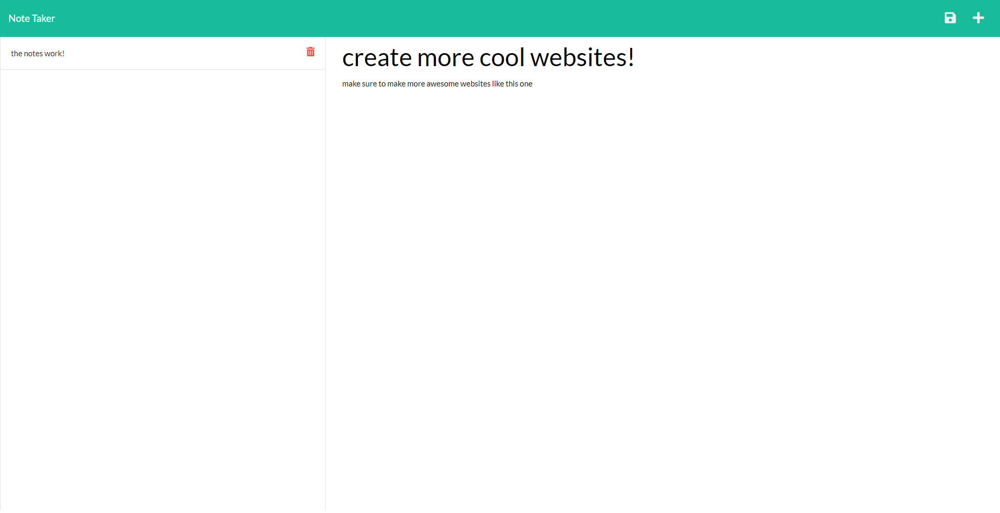

# Note Taker

   

## Need a simple website to create and store notes for you? This is the solution

A simple note taker website that can create, store and delete notes for you utilizing the Express.js framework.

[You can try the site out for yourself here!](https://express-note-taker-nodejs.herokuapp.com/)

Table of Contents:
- [Installation](#installation)
- [Usage](#usage)
- [Credits](#credits)
- [Demo](#demo)

## Installation

```
npm i
```

## Usage

```
npm start
```

## Credits

- Author: Garrett Lee

---

## Demo
